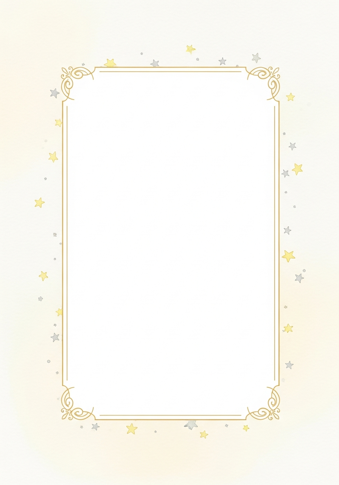

# Portadilla (Title Page)

## Ubicación
- **Página**: Página 1 (primera página interior)
- **Aplica a**: Libros Personalizados y Haz tu Historia

## Diseño

### Fondo Fijo
- **Archivo**: `static/images/title_page_background.png`
- **Estilo**: Marco dorado simple con estrellas, similar al de créditos
- **El fondo NO cambia** entre libros

### Texto Dinámico
El código añade el título y la frase sobre el fondo fijo.

## Contenido por Libro

### Dragon Garden
**Título**: "El Jardín del Dragón de [Nombre]" / "[Name]'s Dragon Garden"
**Frase ES**: "Una aventura mágica donde los sueños florecen"
**Frase EN**: "A magical adventure where dreams bloom"

### Magic Chef  
**Título**: "El Chef Mágico de [Nombre]" / "[Name]'s Magic Chef"
**Frase ES**: "Una deliciosa aventura en la cocina encantada"
**Frase EN**: "A delicious adventure in the enchanted kitchen"

### Haz tu Historia
**Título**: "[Título del tema] de [Nombre]" / "[Name]'s [Theme Title]"
**Frase**: Generada por GPT según el tema elegido

## Imagen de Referencia

## Tipografía
- **Título**: Fuente decorativa/fantasy, 36-48pt, color oscuro (#2E1A47)
- **Frase**: Fuente elegante/cursiva, 18-24pt, color marrón dorado (#8B4513)
- **Alineación**: Centrado vertical y horizontal

## Implementación
El código debe:
1. Cargar `static/images/title_page_background.png`
2. Redimensionar al tamaño de página
3. Añadir título centrado (parte superior del área central)
4. Añadir frase centrada (debajo del título)
